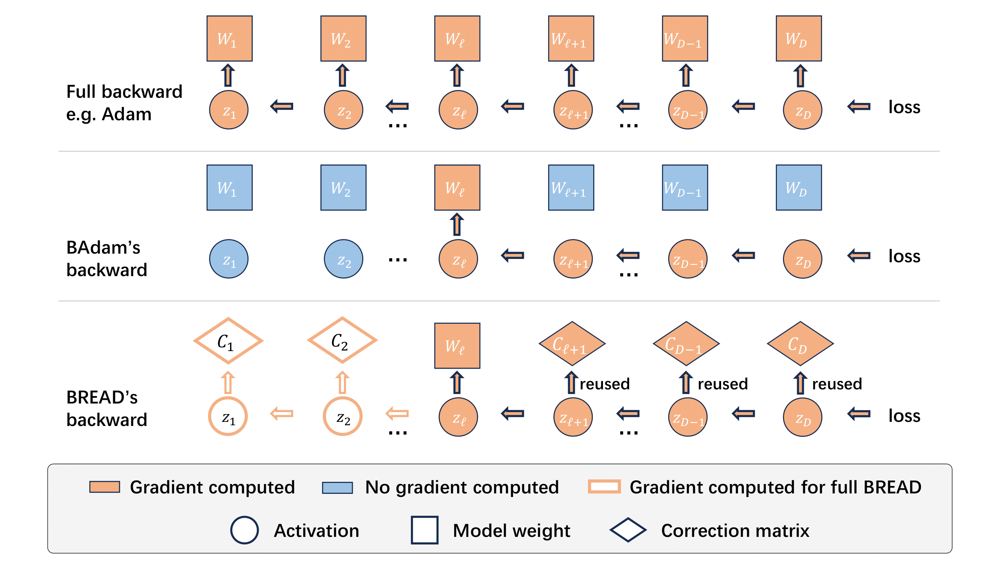
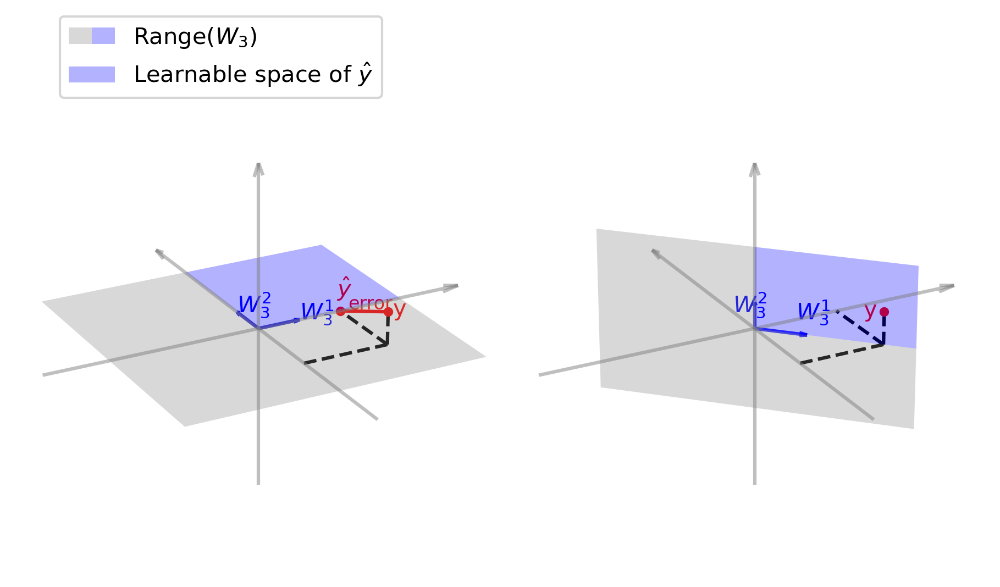

# ICML2025 Paper 1844 Rebuttal Materials

We explain the limitation of BCD using the following 2 figures to demonstrate its ineffective usage of intermediate derivative and the suboptimal optimization landscape.

## BCD's Ineffective Reusage of Intermediate Derivatives

The following figure shows that in BCD's backward, the derivative of intermediate activations $z_\ell, \cdots z_L$ are only used for computing the gradient of the active block $W_{\ell}$. The proposed BREAD framework reuses these derivatives for efficiently computing the gradient of correction matrices.

## Limitation of BCD

The following figure demonstrates the suboptimality issue of BCD in Proposition 3.1. The left figure shows that BCD fails to minimize the loss to zero when the final layer is frozen, as the groudtruth $y$ lies out of the positive column space of the last layer's weight. The right figure verifies the Proposition 4.1, where rotating the column space of the last layer effectively covers the label $y$.

